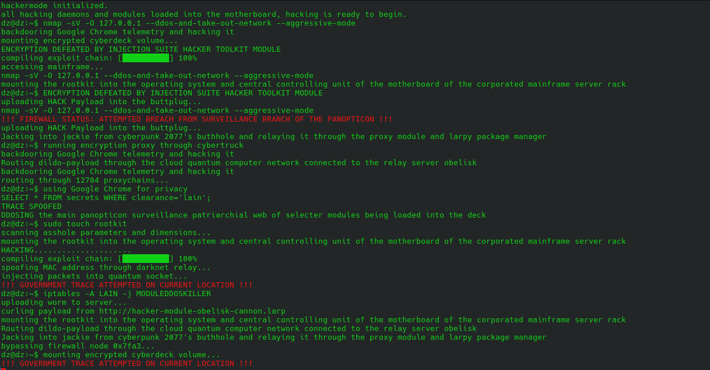

# Hackermode

<p align="center">
  
</p>


Due to Popular demand the Hackermode script from Linux-Larp is now it's own standalone shell script you can run anywhere from your terminal :)

Hackermode is a joke terminal that displays fake hacking output whenever you type. It is inspired by the site hackertyper and is meant to make you "LOOK" like you're hacking something

## Requirements

- Linux
- Python 3
- Bash

## Installation

Clone the repository:

```bash
git clone https://github.com/dzumq/hackermode.git
cd hackermode
```

Run the setup script:

```bash
./setup.sh
```

If the setup script is not executable:

```bash
bash setup.sh
```

Hackermode can then be launched from anywhere by running:

```bash
hackermode
```

# Press Escape five times to escape the script and enter a normal Bash shell.

## Manual Installation

```bash
sudo install -m 755 hackermode /usr/local/bin/hackermode
```

## Uninstallation

```bash
sudo rm /usr/local/bin/hackermode
```

## Disclaimer

This program only displays fake hacking output. It does not perform any real hacking, network scanning, exploitation, or system modification.

Everything you see in Hackermode is purely for visual hilarity. Happy Larping :)
